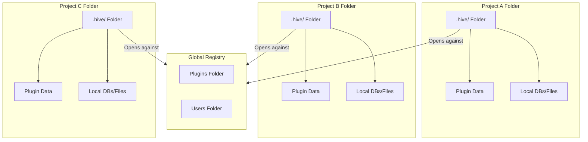
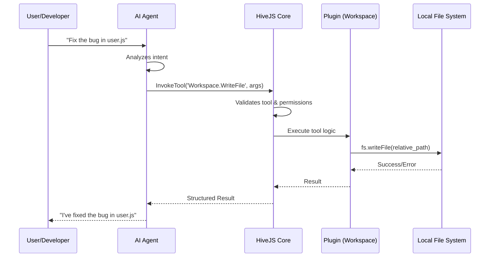
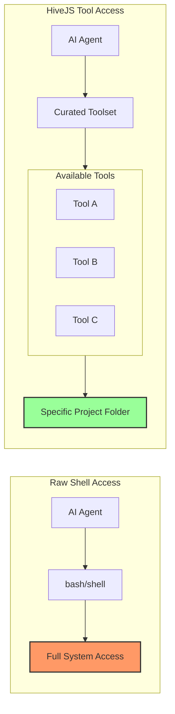

# Architecture Visuals: Design Specifications

This document defines the requirements for the visual diagrams needed to explain the HiveJS architecture.

## Diagram 1: Registry vs. Hive (The Scope Model)
**Goal:** Visualize the relationship between the global registry and the per-folder hive instances.

**Visual Elements:**
- **Global Registry (Center):** A large box containing:
    - `Plugins/` folder (Shared blueprints for all Hives)
    - `Users/` folder (Central identity store)
- **Project Folders (Periphery):** Three separate project folder icons (e.g., `Project-A`, `Project-B`, `Project-C`).
- **The Hive (Inside Projects):** Inside each project folder, a smaller `.hive/` folder containing:
    - `PluginData/` (Project-specific configuration and state)
    - Local DBs/Files (Isolated data)
- **Connecting Lines:** Arrows showing a Hive "opening" against the Registry to load plugin definitions.

## Diagram 2: The Tool Invocation Flow (The Request Path)
**Goal:** Trace a request from the user's intent to the local system action.

**Flow Sequence:**
1. **User/Developer:** "Fix the bug in user.js" $\rightarrow$
2. **AI Agent:** Analyzes intent $\rightarrow$ selects tool `Workspace.WriteFile` $\rightarrow$
3. **HiveJS Core:** Validates tool name $\rightarrow$ checks user permissions $\rightarrow$
4. **Plugin (Workspace):** Executes the actual Node.js `fs.writeFile` logic using the project-relative path $\rightarrow$
5. **Local File System:** File is updated on disk.
6. **Response Loop:** Result $\rightarrow$ HiveJS $\rightarrow$ AI Agent $\rightarrow$ User.

## Diagram 3: The "Sandbox of Truth" (Comparison)
**Goal:** Contrast raw shell access vs. HiveJS tool access.

- **Left Side (Raw Shell):** A "Wild West" visual. AI agent $\rightarrow$ `bash` $\rightarrow$ Full system access (Risky).
- **Right Side (HiveJS):** A "Curated Gallery" visual. AI agent $\rightarrow$ [ Tool A | Tool B | Tool C ] $\rightarrow$ Specific project folder (Secure).
